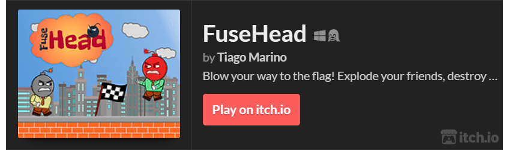
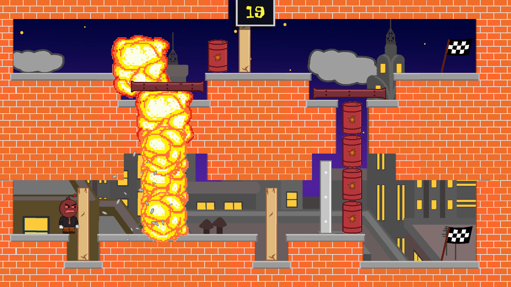
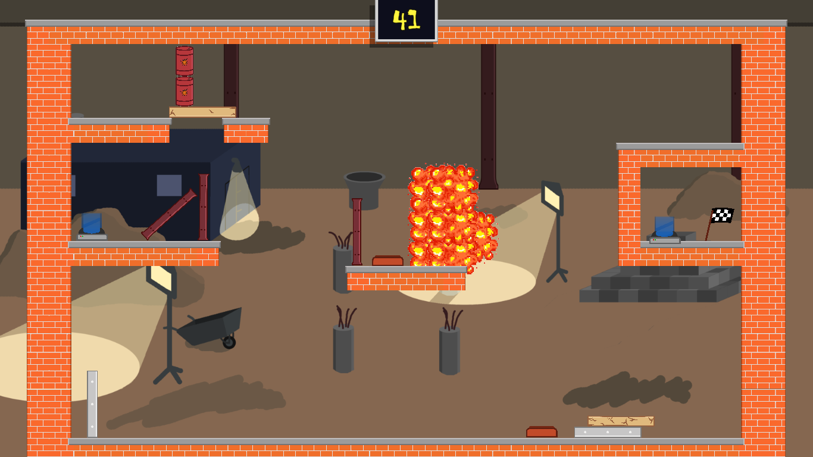
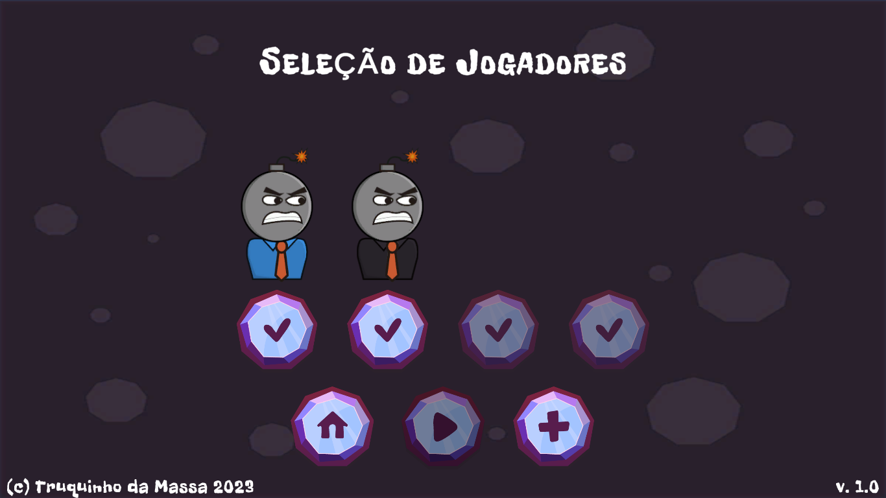
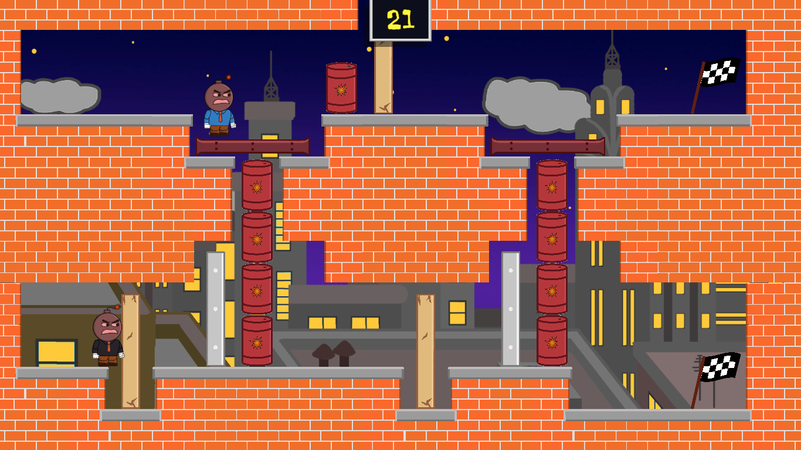
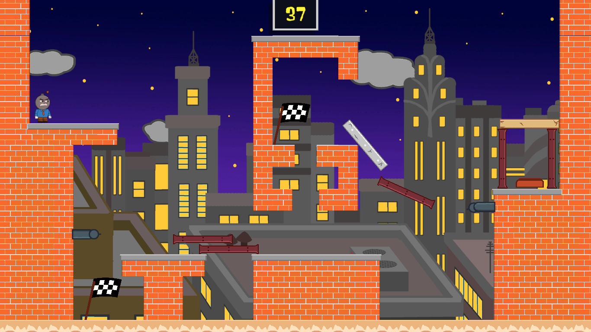
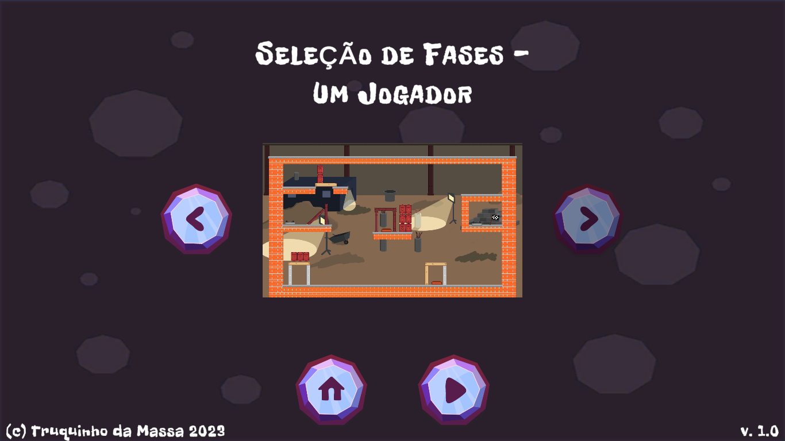
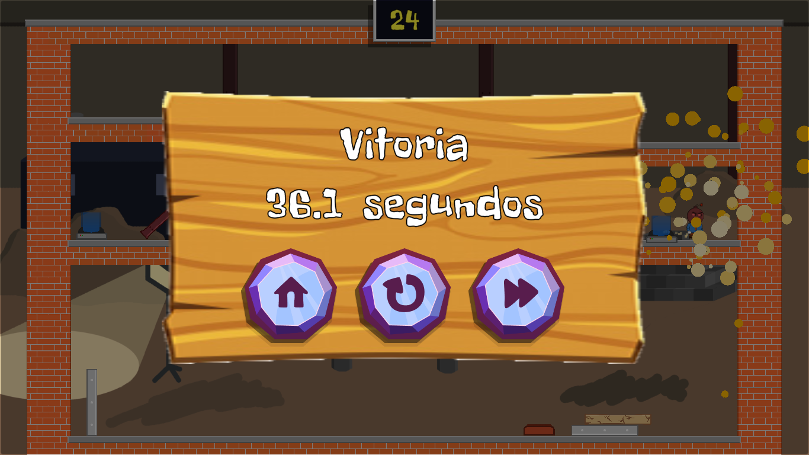
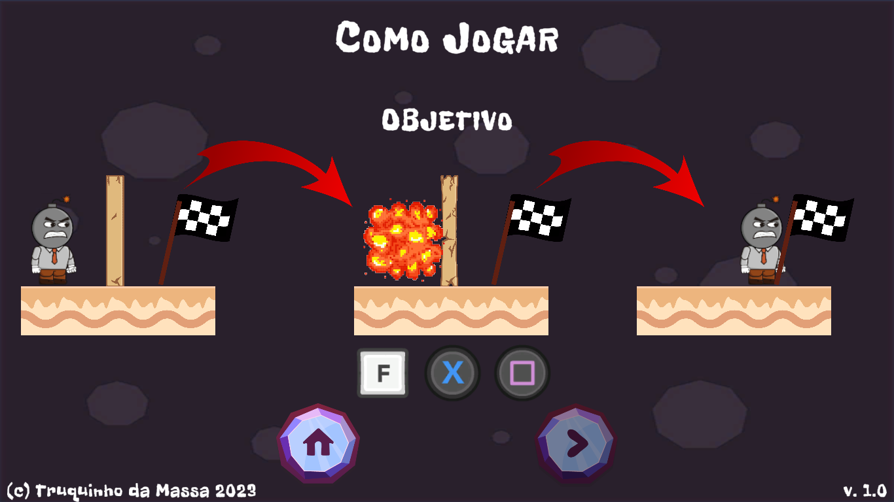

# FuseHead

* Fuse Head is a multiplayer coop puzzle game made in unity. 
* Play with up to 4 players

# Explode stuff!

# Play with friends!

## ...or alone

# Replay and master your favorite levels!

# Easy to learn, hard to master!
